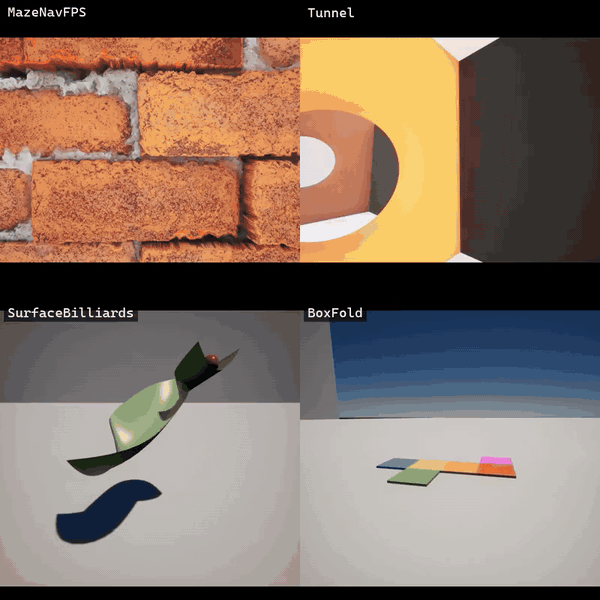
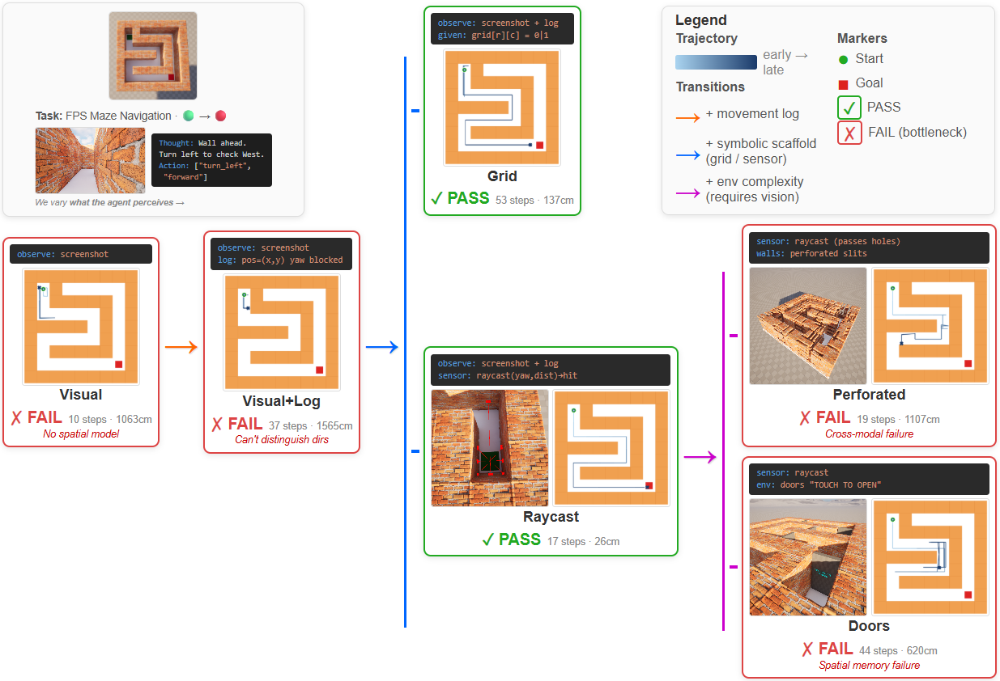

# VeriWorld

### A Verifiable Visual SWE-Bench for Spatial Reasoning in 3D Environments

<p align="center">
  
</p>

**What's the right way for a VLM to reason about space — through intuitive perceptual judgment, or through explicit symbolic reasoning with verifiable outcomes?**

Vision-language models are increasingly deployed on spatial tasks — navigation, manipulation, physical prediction — where they must recover task-relevant structure from visual input and act on it under feedback. Existing benchmarks test perception **or** reasoning in isolation, so when a model fails it's unclear whether the failure sits in vision, in reasoning, or in the bridge between them.

**VeriWorld** evaluates the *same* task under three matched input settings — **visual-only**, **structured**, and **combined** — while holding the environment and objective fixed. This controlled design attributes failures directly to perception, reasoning, or their interaction, rather than collapsing them into a single aggregate score.

<p align="center">
  
</p>

Key design pillars:

- **Interactive.** The agent observes a 3D scene, acts, and receives feedback — not a single static query.
- **Verifiable.** Every task has a deterministic pass/fail checker (closed-form, Slang compute shader, or Lean 4 proof).
- **Diagnostic.** Matched three-condition ablation on every task isolates the perception → structure → action pipeline.
- **Parameterized.** Seeded generators produce unlimited novel instances per task.

What the pilot results show:

- A **visual-to-structure gap** — models succeed with structured spatial signals (e.g., raycasts) but fail when the *same information* must be inferred from visual input. This isolates the perception-to-structure conversion as a key bottleneck.
- **Interaction protocol is itself a confounding variable** — holding task and information fixed, changing the action space or harness design can flip failure to success. Benchmark conclusions that don't vary harness independently conflate multiple bottlenecks.

The packaged Unreal Engine build is distributed separately via access-gated Google Drive — see [docs/ACCESS.md](docs/ACCESS.md). This repository contains the Python harnesses, Slang compute shaders, and documentation.

---

## Quick Start

1. **Request the packaged UE build.** Fill the [access request form](https://docs.google.com/forms/d/e/1FAIpQLSfEJuktF1lUhlhHTz0i0P9-rMevgQHZGHGkKoZWHwwUMsflTQ/viewform) (terms in [docs/ACCESS.md](docs/ACCESS.md)). Once approved, a Google Drive folder is shared to your account containing `PackagedOutput/` (interactive tasks) and `PackagedOutput_dev/` (computational tasks). Download both, extract anywhere convenient (e.g. `C:\builds\VeriWorld\`) — you'll point `run_defaults.json` at them in step 3.
2. Install the package (editable install keeps the code in place for editing / `git pull`):
   ```
   git clone https://github.com/yanyanzheng96/VeriWorld.git
   cd VeriWorld
   pip install -e .
   ```
3. **Set up the two config files** (both gitignored, one-time per machine):

   - **`model_configs.json`** — API keys + `parallel: true/false` per model. Three key formats: raw string, `"env:VAR_NAME"`, or a list (auto-rotated on 429 / 503 / 529). Optional `extra_params: {...}` merges into every request payload (e.g. `{"reasoning_effort": "minimal"}` for GPT-5 models). Copy `model_configs.example.json` → `model_configs.json` and fill in. See [`docs/MODELS.md`](docs/MODELS.md) for which models we've tested, their latencies, and vendor-diverse recommendations for the interactive vs computational clusters.
   - **`run_defaults.json`** — build paths + per-task run knobs (seeds, max_steps, grid_size, tunnel_radius, …). Copy `run_defaults.example.json` → `run_defaults.json`. Edit the two `builds` paths to match your UE build extraction.

   Precedence for any flag: CLI argument > `run_defaults.tasks[<task>]` > `run_defaults.parallel` > hardcoded fallback.
4. Run tasks with the one-click launchers under [`example_starters/`](example_starters/). Every `.bat` is a one-liner that calls the orchestrator; **all knobs live in `run_defaults.json`**.

   ```
   example_starters/
   ├── mazenavfps/{1_launch_ue, 2_run_vp_bf, 2_run_pv_bf}.bat
   ├── tunnel/{1_launch_ue, 2_run_vp_bf, 2_run_af}.bat
   └── surface_billiards/run.bat
   ```

   `1_launch_ue.bat` is **optional** — only needed when you want to attach to a pre-launched UE for faster debug iteration. It reads the build path from `run_defaults.json` too.

   Or, manually from a shell:
   ```
   # Fair-comparison parallel run (reads everything from run_defaults.json)
   python -m veriworld.scripts.run_parallel \
       --task veriworld.benchmark.interactive.navigation.mazenavfps.vp_bf

   # Debug iteration — attach to a hand-launched UE, single model
   python -m veriworld.scripts.run_parallel \
       --task veriworld.benchmark.interactive.navigation.mazenavfps.vp_bf \
       --seeds 0 --attach --models gpt-4.1
   ```
   CLI flags override corresponding entries in `run_defaults.json`.

### Fair-comparison parallelism

The orchestrator enforces that each seed is run on every participating model **simultaneously**. `--max-instances` (default 6, the single-24 GB-GPU VRAM budget) caps concurrency; batches are rounded to a multiple of `N_models` so no seed ever straddles batches. Which models participate is controlled by the `"parallel": true|false` flag on each entry in `model_configs.json`, or overridden with `--models name1,name2`.

---

## Task families

VeriWorld's tasks split into four families along two axes:

- **Execution paradigm** — `interactive/` (single persistent UE, per-tick loop) vs `computational/` (per-round UE restart, fresh CUDA state every round).
- **What the agent is actually being tested on** — spatial navigation, visual recognition, numerical parameter tuning, or code authorship.

| Family | Path | What's being tested | Per-step VLM output | Example |
|---|---|---|---|---|
| **interactive / navigation**  | `interactive/navigation/*`  | Recovering spatial structure from a moving first-person viewpoint — mapping, goal-seeking, orientation under partial observability. | A movement command (commonly a batch of primitive commands like `forward D` / `turn A`, sometimes a compound `{see, yaw, pitch, forward}`). | `mazenavfps`, `tunnel` |
| **interactive / recognition** | `interactive/recognition/*` | Extracting visual information from a largely-static viewpoint — identifying, counting, comparing, answering questions, or choosing among a finite set of discrete actions. | A discrete label / JSON answer / choice from a closed set. | *(planned — not yet populated)* |
| **computational / feedback**  | `computational/feedback/*`  | Physical or numerical intuition under video feedback — tuning a small fixed vector of scalars so the ball lands, the valve opens, the trajectory closes the loop. | `observation / knowledge / <param1> / <param2>` text lines. No code. | `surface_billiards` |
| **computational / coding**    | `computational/coding/*`    | Code authorship itself — the agent writes a complete Python script that designs the scene / surface / trajectory / controller under test. | A full ```` ```python ... ``` ```` block. | `drop_to_target` |

Why the split matters:

- **Interactive / navigation and recognition** differ on whether the agent mainly *moves through* space (navigation — spatial reasoning dominates) or *interprets* what it sees from a relatively fixed vantage (recognition — perception-to-label dominates). Both use a persistent UE with per-tick feedback; the distinction is about what the model is expected to do with each frame.
- **Computational / feedback** tests physical intuition: the agent tunes a handful of parameters and watches the outcome. Asking it to emit setup code every round wastes tokens and risks breaking the scene's visual invariants. The harness owns the setup; the agent owns the parameters.
- **Computational / coding** tests programming ability directly: the agent designs the scene / surface / controller. Here full code *is* the action space — restricting to scalars would change what the task is actually measuring.

Orthogonal to the family axis, each task may have several **Layer-3 ablation subfolders** that vary the *action space* or *knowledge organisation* within the family — e.g. `mazenavfps/harness_structured/vp_bf/` (batched primitives) vs `tunnel/harness_structured/af/` (compound aim-and-fly) both live inside interactive / navigation but expose the agent to different action spaces. Layer-3 ablations are housed inside a `harness_<descriptor>/` wrapper that represents the **meta-architecture** of the experiment (state-memory ownership, LLM call budget, determinism); see the three-layer design below and the harness convention at `infra/harness/SKILL.md`.

A new task picks its family based on "what is actually being tested":
spatial navigation → `interactive/navigation/`; visual Q&A / discrete
choice → `interactive/recognition/`; scalar parameter tuning →
`computational/feedback/`; code authorship → `computational/coding/`.

---

## Three-Layer Design

VeriWorld is organised as three concentric layers — read them top-down to understand how a new task flows through the repo.

### Layer 1 — **Skills + framework** (`veriworld/infra/`)

*Everything a new task author needs on the VeriWorld side.* The one thing **not** here is the UE plugin's Python API reference (`ur.Engine.*`, `ur.Voxel.*`, `ur.submit_tick_task`, …) — that ships with the UELivePy package itself, since it evolves alongside the plugin. Read the shipped `benchmark/**/task.py` + `ue_setup.py` files for inline usage, and consult the UELivePy package docs for the rest.

> **Highly recommended reading for `ur.Voxel.*` usage**: the [VoxelCodeBench paper](#citation) (Zheng & Bordes, 2026) introduces the voxel-code framework and is the authoritative reference for idiomatic voxel API patterns. Task authors working on voxel-heavy scenes will save time by skimming it first.

VeriWorld-authored skill docs (scope + API reference + templates):

- `infra/slang/` — Slang compute shader conventions (what's available in UE-RDG runtime, what CUDA features are **out** of scope).
- `infra/lean/` — Lean formal-verification harness (for tasks whose correctness criterion is mathematically statable).
- `infra/harness/` — Harness folder organization convention. How to house multiple experiment-design conditions (state-memory ownership, LLM call budget, …) within one task without cross-contamination. Required reading before adding a new harness sibling under any task.

Engine framework (the runtime the ablations plug into — copy the template, call the engine):

- `infra/interactive/engine.py` — `InteractiveEngine`: persistent UE instance, WebSocket attach / launch / teardown.
- `infra/interactive/task_template.py` — annotated skeleton with a MazeNavFPS example inlined as comments.
- `infra/computational/engine.py` — `ComputationalEngine`: per-round UE restart (for Slang-verified tasks).
- `infra/computational/task_template.py` — skeleton with SurfaceBilliards example inlined as comments.

### Layer 2 — **Task parameterization + solvability proofs** (per-task root)

*What makes each task a valid benchmark unit.* Every task (e.g. `benchmark/interactive/navigation/mazenavfps/`) has at its root:

- `generate_params.py` — pure, seeded scene generator. All **scene-level ablation axes** (grid size, wall material count, tunnel radius, start/goal yaw, …) are parameters here. Seed determinism guarantees reproducibility across runs and across models.
- `ue_setup.py` + `move_camera.py` — UE-side scene builder and per-tick movement loop. Shared across every ablation of the task.
- A **solvability certificate** per task: either (a) a trivial closed-form check (maze goal distance), (b) a Slang compute shader that simulates ground-truth physics deterministically (`surface_billiards/lean_verify/billiard_ball.slang`), or (c) a Lean 4 proof (planned for coding tasks). Without this, ablation results are meaningless — "the model failed" is not a claim unless you know the task was solvable.

This layer is where a task author defines "what the task is" and "how success is measured". Scene-level knobs added here become CLI flags, not new subfolders.

### Layer 3 — **Agent-harness ablations** (per-task subfolders, housed under a `harness_*/` wrapper)

*How the agent interacts with the task.* Layer-3 ablations live inside a **harness** wrapper — a `harness_<descriptor>/` folder that groups ablations sharing the same meta-architecture (state-memory ownership, LLM call budget, determinism). Within one harness, sibling subfolders encode **different action spaces or knowledge organizations** — each a self-contained, straight-line `task.py` with no branching, no condition switch:

- `mazenavfps/harness_structured/vp_bf/` — screenshot + position log, batch-free commands.
- `mazenavfps/harness_structured/pv_bf/` — pure vision history grid, no coords, BLOCKED/ok only.
- `tunnel/harness_structured/vp_bf/` — standard navigation.
- `tunnel/harness_structured/af/` — compound aim-and-fly action space.

**When to add a new Layer-3 subfolder**: changes to action space, protocol, or knowledge organization *within the same meta-architecture*. Layer-3 siblings share `harness_<descriptor>/_common.py`.

**When to add a new harness instead** (a sibling `harness_<other>/`): the change is meta-architectural — e.g. agent-authored knowledge.md with a per-step summarizer call, rather than harness-maintained structured state. This is a stronger divergence and warrants full folder isolation (own `_common.py`, own README) so two designs don't silently drift into a hybrid. See `veriworld/infra/harness/SKILL.md` for the convention and `examples/` for a copy-ready shape.

Changes that only vary scene parameters belong in Layer 2 — add a CLI flag, not a folder.

---

## Repository Layout

```
VeriWorld/
├── pyproject.toml
├── README.md · LICENSE · NOTICE.md
├── model_configs.example.json         # copy to model_configs.json and fill in
├── example_starters/                  # one-click .bat launchers per task
├── docs/                              # ACCESS, FORM_TEMPLATE, design notes
└── veriworld/                         # Python package (pip install -e .)
    ├── infra/                         # LAYER 1 — skill docs (VeriWorld-authored) + engine framework
    │   ├── lean/     (SKILL.md · api.md · examples/)
    │   ├── slang/    (SKILL.md · api.md · examples/)
    │   ├── harness/  (SKILL.md · examples/harness_example/)   ← folder-organization convention
    │   ├── interactive/               # persistent-UE engine + task_template
    │   │   ├── engine.py              # InteractiveEngine
    │   │   └── task_template.py       # skeleton with MazeNavFPS example in comments
    │   └── computational/             # per-round-restart engine + task_template
    │       ├── engine.py              # ComputationalEngine
    │       └── task_template.py       # skeleton with SurfaceBilliards example in comments
    │   # NB: UE plugin Python API docs live with the UELivePy package, not here.
    ├── benchmark/                     # LAYER 2 (task roots) + harness_* wrappers (LAYER 3 inside)
    │   ├── interactive/navigation/    # launched with PackagedOutput
    │   │   ├── README.md              # family-level harness index (points at infra/harness/)
    │   │   ├── mazenavfps/
    │   │   │   ├── generate_params.py · ue_setup.py · move_camera.py         ← layer 2 (shared across harnesses)
    │   │   │   └── harness_structured/                                        ← harness (meta-architecture)
    │   │   │       ├── README.md · _common.py                                 ← harness-level design + helpers
    │   │   │       ├── vp_bf/         ← layer 3 ablation (task.py + __main__.py)
    │   │   │       └── pv_bf/         ← layer 3 ablation
    │   │   └── tunnel/
    │   │       ├── generate_params.py · ue_setup.py · move_camera.py         ← layer 2 (shared)
    │   │       └── harness_structured/
    │   │           ├── README.md · _common.py
    │   │           ├── vp_bf/         ← layer 3 ablation
    │   │           └── af/            ← layer 3 ablation
    │   └── computational/              # launched with PackagedOutput_dev
    │       ├── feedback/surface_billiards/
    │       │   ├── generate_params.py · setup_observe.py · setup_shot.py            ← layer 2
    │       │   ├── lean_verify/bouncy_ball.slang                                     ← layer 2 solvability
    │       │   └── task.py + task.md + __main__.py                                   ← parameter-only ablation (pre-harness-wrap; will be moved to harness_video/ in a follow-up)
    │       └── coding/drop_to_target/
    │           ├── generate_params.py · setup_observe.py · example.py               ← layer 2
    │           ├── lean_verify/{slide_ball.slang · DropToTarget.lean · …}            ← layer 2 solvability
    │           └── visual/              ← layer 3 ablation (pre-harness-wrap)
    └── common/                        # cross-cutting utilities (ws, vlm, logger, screenshot)
```

---

## Packaged Build

Two Windows builds are distributed. Each task category uses its own build:

| Build | Used by |
|-------|---------|
| `PackagedOutput`     | Interactive tasks (recognition, navigation) |
| `PackagedOutput_dev` | Computational tasks (feedback, coding)      |

Request access: **[fill the access form](https://docs.google.com/forms/d/e/1FAIpQLSfEJuktF1lUhlhHTz0i0P9-rMevgQHZGHGkKoZWHwwUMsflTQ/viewform)** — typical turnaround 5 business days. Full terms and process in [docs/ACCESS.md](docs/ACCESS.md). After approval, a Google Drive folder with both builds is shared to your account; extract and point `run_defaults.json` at them (see Quick Start above).

---

## Authoring a new task

Read the skills under [`veriworld/infra/`](veriworld/infra/). Each skill document has a scope note, capability table, API reference, and copy-ready templates in its `examples/` directory.

---

## License

PolyForm Noncommercial License 1.0.0 — see [LICENSE](LICENSE) and [NOTICE.md](NOTICE.md).

**Academic use is broadly permitted**: evaluating models, reporting scores in publications, and **building new academic benchmarks, datasets, or research tools that extend this work**. What's *not* permitted: training commercial models on VeriWorld or its outputs, incorporating it into commercial products, or commercial benchmark republication. See NOTICE §2 for the full scope.

**Attribution is mandatory for academic follow-up work** that builds on, extends, or is substantially informed by VeriWorld. You must both (a) cite VeriWorld per `CITATION.cff` (forthcoming) **and** the VoxelCodeBench paper (see Citation section below) — both citations are required for any use of VeriWorld *and* (b) explicitly acknowledge VeriWorld in the body of the work — citation alone is not sufficient. See NOTICE §2.2.1 for the exact requirement.

## Citation

If you use VeriWorld in published work, you must cite **both** of the following:

1. **VeriWorld** itself — per `CITATION.cff` (forthcoming).
2. **VoxelCodeBench** — the companion work that introduces the voxel-code generation framework on which VeriWorld's 3D task environments are built. Citation is required for all uses of VeriWorld, not just work that touches the voxel API directly.

```bibtex
@article{zheng2026voxelcodebench,
  title={VoxelCodeBench: Benchmarking 3D World Modeling Through Code Generation},
  author={Zheng, Yan and Bordes, Florian},
  journal={arXiv preprint arXiv:2604.02580},
  year={2026}
}
```

## Contact

- Access requests / build issues: `axisworld.team@gmail.com`
- Licensing / commercial inquiries: `yan.zheng.mat@gmail.com`
